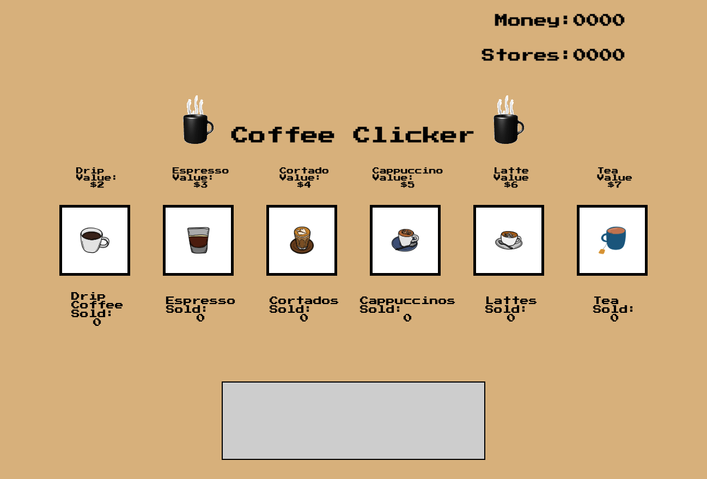
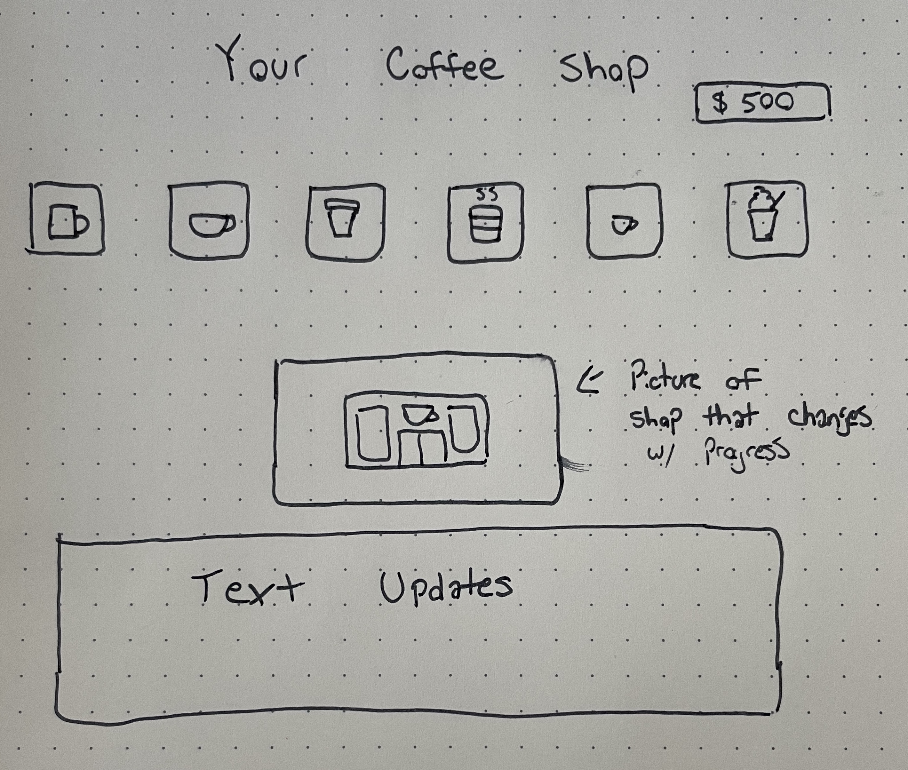

# project1

Coffee Clicker Game

1. I wanted my game to be an interactive clickable game with no alerts or prompts.
2. The objective is to click the buttons as much as you can in order to make more money.
3. There are bonus's for reaching certain milestones that will multiply your earnings.

Technologies Used:

For my project I mainly used HTML, CSS, and a whole lot of Javascript. When I was stumped I used resources such as W3, Mozilla, and Google.

User Stories

MVP
1. I wanted my game to be fully funtioning and interactive as well as having secret bonus's
2. I wanted my game to be an easy to figure out game that you can take your time in or win as quickly as you want to.

Stretch Goals
1. I was hoping to include events at a randomized time but I could not figure it out.
2. A celebration screen with animations was something I was loooking forward to but was beyond my current scope.

Wireframe

Problems

1. Some of the biggest problems I faced was getting all of my CSS to align in an orderly fashion and in the way I envisioned it.

2. My other problem was working with various functions and event listeners and keeping track of what was happening throughout the game.